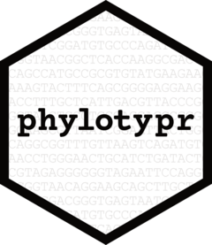

<!-- README.md is generated from README.Rmd. Please edit that file -->

```{r, include = FALSE}
knitr::opts_chunk$set(
  collapse = TRUE,
  comment = "#>",
  fig.path = "man/figures/README-",
  out.width = "100%"
)
```

# phylotypr <a href="https://mothur.org/phylotypr/"></a>

<!-- badges: start -->

[](https://cran.r-project.org/package=phylotypr)
[](https://github.com/mothur/phylotypr/actions/workflows/R-CMD-check.yaml)
[](https://app.codecov.io/gh/mothur/phylotypr?branch=main)
[](https://CRAN.R-project.org/package=phylotypr)

<!-- badges: end -->

## Overview

phylotypr is a package for classification based analysis of DNA sequences. This package primarily implements Naive Bayesian Classifier from the Ribosomal Database Project. Although you can classify any type of sequence (assuming you have the proper database), this algorithm is mainly used to classify 16S rRNA gene sequences.


## Installation

You can install the development version of phylotypr from [GitHub](https://github.com/) with:

``` r
# install.packages("devtools")
devtools::install_github("mothur/phylotypr")
```

You can also get the official release version from CRAN

``` r
install.packages("phylotypr")
```


## Usage

Be sure to see the [Getting Started](https://mothur.org/phylotypr/articles/phylotypr.html) article to see an example of how you would build the database and classify individual and multiple sequences.


## Reference databases

The `{phylotypr}` package ships with the RDP's v.9 of their training data. This is relatively small and old (2010) relative to their latest versions. You are encouraged to install newer versions of the RDP, greengenes, and SILVA databases from the `{phylotyprrefdata}` package on GitHub. Note that installing the package will take about 20 minutes to install. If it sits at "moving datasets to lazyload DB" for a long time, this is normal :)

```{r, eval = FALSE}
devtools::install_github("mothur/phylotyprrefdata")
library(phylotyprrefdata)
```

The following will list the references that are available in `{phylotyprrefdata}`:

```{r, eval = FALSE}
data(package = "phylotyprrefdata")
```


## More information about `{phylotypr}`

You can learn more about the underlying algorithm in the paper that originally described the algorithm that was published in [*Applied and Environmental Microbiology*](https://pubmed.ncbi.nlm.nih.gov/17586664/). If you want to learn more about how this package was created, be sure to check out the mothur YouTube channel where a [playlist is available](https://www.youtube.com/watch?v=XjolVT16YNw&list=PLmNrK_nkqBpIZlWa3yGEc2-wX7An2kpCL) showing every step.
